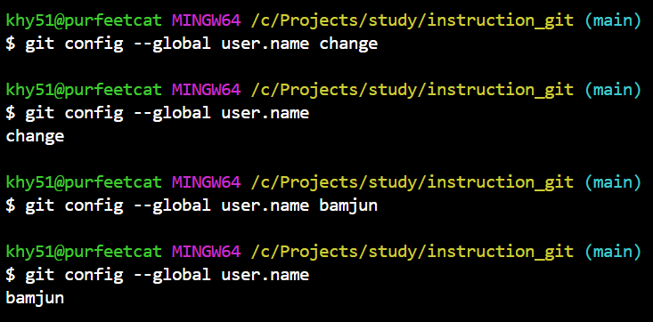
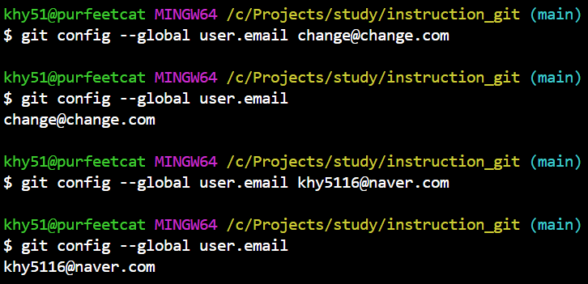
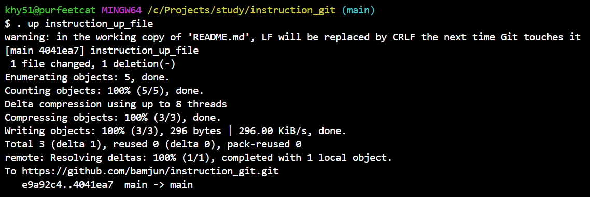
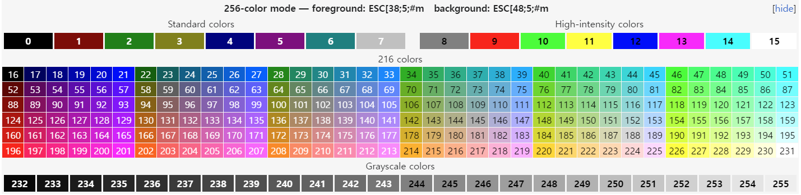

# 깃 & 깃허브 [link](https://github.com/bamjun/instruction_git)  

## $$\color{purple}\fbox{\Huge \color{pink}{프로젝트 시작 예제}}$$  
- github에서 레포지토리 만들기.  
- github 레포지토리에서 레포지토리 url 복사.
- 로컬환경에서 프로젝트 시작할 폴더 만들고 `git init` 하기
  &darr; `\` &darr; `bash shell`
  ```bash
  git init
  ```

- 프로젝트 폴더의 전체 파일 `add`하기  
  &darr; `\` &darr; `bash shell`
  ```bash
  git add .
  ```

- 커밋 만들기  
  - git commit -m '[메세지]'
    &darr; `\` &darr; `bash shell`
    ```bash
    git commit -m 'first'
    ```

- 깃허브 레포지토리 주소 추가하기  
  - git remote add [주소별칭] [github주소]
    &darr; `\` &darr; `bash shell`
    ```bash
    git remote add origin https://github.com/bamjun/instruction_git
    ```

- 깃허브에 업로드하기  
  - git push -u [주소별칭] [브랜치이름]
    &darr; `\` &darr; `bash shell`
    ```bash  
    git push -u origin main
    ```

<br>  

---  

<br>

## $$\color{purple}\fbox{\Huge \color{pink}{git 명령어}}$$  
- 현재 환경에 설정된 유저와 이메일 조회하기  
  - 유저 확인하기  
    &darr; `\` &darr; `bash shell`
    ```bash
      git config --global user.name
    ```

  - 유저 변경하기  
    - git config --global user.name [변경할이름]  

    &darr; `\` &darr; `bash shell`
    ```bash
      git config --global user.name change
    ```

      

  - 이메일 확인하기  
    &darr; `\` &darr; `bash shell`
    ```bash
      git config --global user.email
    ```

  - 이메일 변경하기  
    - git config --global user.email [변경할이메일]  

    &darr; `\` &darr; `bash shell`
    ```bash
      git config --global user.email change@change.com
    ```

      

<br>  

<br>  

Windows 환경에서 Git 사용자 이름과 이메일 주소를 확인하는 방법은 명령 프롬프트(Command Prompt) 또는 Git Bash와 같은 터미널을 사용하는 것입니다. 이 정보는 Git의 전역(global) 설정 또는 특정 저장소(repository)의 로컬(local) 설정에 저장됩니다. 다음 단계에 따라 사용자 이름과 이메일을 확인할 수 있습니다.

### 전역 사용자 이름과 이메일 확인하기

1. **명령 프롬프트(Command Prompt) 또는 Git Bash 열기**: 검색을 통해 "cmd" 또는 "Git Bash"를 찾아 실행합니다.
   
2. **Git 전역 사용자 이름 확인**: 다음 명령어를 입력합니다.
   ```sh
   git config --global user.name
   ```
   이 명령은 전역 설정에 저장된 Git 사용자 이름을 출력합니다.

3. **Git 전역 이메일 확인**: 다음 명령어를 입력합니다.
   ```sh
   git config --global user.email
   ```
   이 명령은 전역 설정에 저장된 Git 사용자 이메일을 출력합니다.

### 특정 저장소의 사용자 이름과 이메일 확인하기

Git은 특정 저장소에 대해 다른 사용자 이름과 이메일 주소를 설정할 수 있습니다. 이는 전역 설정보다 우선 적용됩니다. 특정 저장소의 사용자 이름과 이메일 주소를 확인하려면, 해당 저장소의 디렉토리로 이동한 후 다음 명령어를 실행합니다.

1. **저장소 디렉토리로 이동**: `cd` 명령어를 사용해 해당 Git 저장소 디렉토리로 이동합니다.
   
2. **로컬 사용자 이름 확인**: 다음 명령어를 입력합니다.
   ```sh
   git config user.name
   ```
   이 명령은 현재 저장소에 설정된 사용자 이름을 출력합니다.

3. **로컬 이메일 확인**: 다음 명령어를 입력합니다.
   ```sh
   git config user.email
   ```
   이 명령은 현재 저장소에 설정된 사용자 이메일을 출력합니다.

### 설정 변경하기

Git 사용자 이름이나 이메일 주소를 변경하려면, `git config` 명령어에 `--global` 옵션을 사용하여 전역 설정을 변경하거나, 특정 저장소에서 이 옵션을 생략하여 로컬 설정을 변경할 수 있습니다. 예를 들어:

- **전역 사용자 이름 변경**:
  ```sh
  git config --global user.name "새 사용자 이름"
  ```
- **전역 이메일 변경**:
  ```sh
  git config --global user.email "새 이메일 주소"
  ```
- **로컬 사용자 이름 변경** (특정 저장소에서):
  ```sh
  git config user.name "새 로컬 사용자 이름"
  ```
- **로컬 이메일 변경** (특정 저장소에서):
  ```sh
  git config user.email "새 로컬 이메일 주소"
  ```

이렇게 설정을 변경하면, 이후에 수행되는 커밋에서 변경된 사용자 정보가 사용됩니다.

<br>  

--- 

<br>  

## $$\color{purple}\fbox{\Huge \color{pink}{startDjangoVenv}}$$  
- python venv 를 활용해서 장고 프로젝트를 빠르게 실행하기 위한 쉘스크립트  
  - gitignore 사이트에서 장고내용 복붙해서 .gitignore 생성
  - venv 생성 후 가상환경 자동 진입
  - 입력한 버전의 장고 설치
  - 빠른 가상환경 진입을 위한 v 스크립트 생성
  - 깃허브에 빠른 푸쉬를 위한 up 스크립트 생성

- 쉘스크립트 시작시 장고 버전을 입력해야함..  
  - . startDjangoVenv [버전]  
    &darr; `\` &darr; `bash shell`
    ```bash
    . startDjangoVenv 5.0.*
    ```    

<br>  

--- 

<br>  

## $$\color{purple}\fbox{\Huge \color{pink}{up}}$$  
- `up` 파일만들기  

  &darr; `\` &darr; `v`
  ```bash
  #!"C:\Program Files\Git\git-bash.exe"

  if [ -z "$1" ]; then
      echo "커밋 메시지를 입력하세요."
  else
      git add .
      git commit -m "$1"
      git push
  fi
  ```
  <br>  

- github 로 푸쉬 하기위한 파일.  
  - 사용방법  
    - 터미널에서 . up [커밋 메세지]

    &darr; `\` &darr; `bash shell`
    ```bash
    . up test
    ```  

  


---  

  - `up` 파일설명
  
> 이 스크립트는 Git을 사용하여 변경된 모든 파일을 스테이지(stage)하고, 사용자가 제공한 커밋 메시지로 커밋(commit)한 뒤, 원격 저장소(remote repository)에 푸시(push)하는 자동화 작업을 수행하는 Bash 스크립트입니다. 스크립트는 Windows 시스템에서 Git Bash를 통해 실행되도록 설정되어 있습니다. 각 부분에 대한 자세한 설명은 다음과 같습니다:

1. `#!"C:\Program Files\Git\git-bash.exe"`: 이 라인은 "shebang" 또는 "hashbang"이라 불리며, 스크립트 파일이 실행될 때 사용할 인터프리터의 경로를 지정합니다. 여기서는 Windows 시스템에 설치된 Git Bash의 경로를 지정하여, 이 스크립트가 Git Bash를 사용하여 실행되어야 함을 나타냅니다.

2. `if [ -z "$1" ]; then`: 이 조건문은 스크립트에 전달된 첫 번째 인자(`$1`)가 비어 있는지 확인합니다. `-z` 플래그는 문자열의 길이가 0인지 테스트합니다. 즉, 사용자가 커밋 메시지를 입력하지 않고 스크립트를 실행했는지 확인합니다.

3. `echo "커밋 메시지를 입력하세요."`: 사용자가 커밋 메시지를 입력하지 않았다면, 사용자에게 커밋 메시지 입력을 요청하는 메시지를 출력합니다.

4. `else`: 사용자가 커밋 메시지를 입력했을 경우 실행됩니다.

    - `git add .`: 현재 디렉토리의 모든 변경 사항(신규 파일, 수정된 파일, 삭제된 파일)을 스테이징 영역에 추가합니다.
    - `git commit -m "$1"`: 사용자가 입력한 커밋 메시지(`$1`)를 사용하여 스테이징 영역에 추가된 변경 사항들을 커밋합니다.
    - `git push`: 최근 커밋을 현재 브랜치의 원격 저장소에 푸시합니다.

5. `fi`: `if` 조건문의 끝을 나타냅니다.

이 스크립트는 사용자가 커밋 메시지를 입력하지 않으면 경고 메시지를 출력하고, 입력했다면 해당 메시지로 변경 사항을 커밋한 후 원격 저장소에 푸시하는 간단하면서도 효율적인 자동화 과정을 제공합니다. 사용하기 전에 Git이 설치되어 있어야 하며, Git 저장소에서 실행되어야 합니다.

스크립트에서 사용되는 위치 매개변수(Positional Parameters)는 스크립트에 전달된 인자들을 참조하는 데 사용되는 특별한 변수입니다. 이들은 스크립트가 호출될 때 설정되며, 인자의 순서에 따라 `$1`, `$2`, `$3` 등과 같이 번호가 매겨집니다. 예를 들어, `$1`은 첫 번째 인자, `$2`는 두 번째 인자를 나타냅니다. 위치 매개변수를 사용하면 스크립트가 외부에서 전달받은 값에 따라 동작을 달리 할 수 있게 됩니다.

### 위치 매개변수의 종류

- `$0` - 스크립트의 이름 또는 스크립트를 호출하는 명령어. 스크립트 내부에서 이를 참조하면, 스크립트 자체의 이름을 얻을 수 있습니다.
- `$1` ~ `$9` - 첫 번째부터 아홉 번째까지의 인자를 나타냅니다. 스크립트에 전달된 각 인자는 이러한 변수를 통해 접근할 수 있습니다.
- `${10}`, `${11}`, ... - 열 번째 이후의 인자를 참조할 때는 중괄호 `{}`를 사용합니다. 예를 들어, 열 번째 인자는 `${10}`으로 참조합니다.
- `$#` - 스크립트에 전달된 인자의 총 개수를 나타냅니다.
- `$*` - 스크립트에 전달된 모든 인자를 하나의 문자열로 나타냅니다. 인자 사이는 IFS(Internal Field Separator) 환경 변수의 첫 번째 문자(기본값은 공백)로 구분됩니다.
- `$@` - 스크립트에 전달된 모든 인자를 별도의 문자열로 나타냅니다. 각 인자가 따옴표로 둘러싸여 인용됩니다. 이는 `$*`와 비슷하지만, 인자 사이의 공백을 보존하는 데 유용합니다.

### 예제

다음은 위치 매개변수를 사용한 간단한 스크립트 예제입니다:

```bash
#!/bin/bash

echo "스크립트 이름: $0"
echo "첫 번째 인자: $1"
echo "두 번째 인자: $2"
echo "인자 총 개수: $#"
echo "모든 인자(*): $*"
echo "모든 인자(@): $@"
```

이 스크립트를 `example.sh`라는 이름으로 저장하고, 다음과 같이 실행한다고 가정해 보겠습니다:

```bash
./example.sh arg1 arg2 arg3
```

출력은 다음과 같을 것입니다:

```
스크립트 이름: ./example.sh
첫 번째 인자: arg1
두 번째 인자: arg2
인자 총 개수: 3
모든 인자(*): arg1 arg2 arg3
모든 인자(@): arg1 arg2 arg3
```

위치 매개변수를 이용하면 스크립트가 보다 유연하게 동작하도록 만들 수 있으며, 사용자로부터 입력 받은 값에 따라 다양한 작업을 수행할 수 있습니다.

<br>

---  

<br>

## $$\color{purple}\fbox{\Huge \color{pink}{bash shell 단축키}}$$  

- ctrl + w
  - 앞의 한단어 삭제  
  
- alt + d
  - 뒷의 한단어 삭제

- ctrl + l
  - 화면 clear(스크롤 위로올리면 이전 라인 볼수있음.)

- ctrl + u
  - 입력한 라인 삭제


<br>

---  

<br>

## $$\color{purple}\fbox{\Huge \color{pink}{bash shell 색상표현}}$$  



- 배쉬쉘에서 글자색과 배경색을 선택해서 글자색을 쉘에서 표현가능. [위키](https://en.wikipedia.org/wiki/ANSI_escape_code)  
  - 글자색 지정하기  
    - "\033[38;5;[ 0~255 글자색지정하기 ]m"
    - 색상표에서 0 부터 255 의 숫자로 색상지정가능.
    - 글자색 변경후, COLOR_RESET 해야함. 안하면 계속 글자색 변경됨.  
    
    &darr; `/` &darr; `bash`
    ```bash
    COLOR_RESET="\033[0m"
    echo -e "\033[38;5;9m test color ${COLOR_RESET}"
    ```  


- 배경색 지정하기  
  - "\033[48;5;[ 0~255 배경색지정하기 ]m"  

    &darr; `/` &darr; `bash`
    ```bash
    COLOR_RESET="\033[0m"
    echo -e "\033[48;5;9m test color ${COLOR_RESET}"
    
    ```  

- 글자색 배경색 동시에 적용가능  
  - "\033[38;5;[ 0~255 글자색지정하기 ]m\033[48;5;[ 0~255 배경색지정하기 ]m"

    &darr; `/` &darr; `bash`
    ```bash
    COLOR_RESET="\033[0m"
    echo -e "\033[38;5;9m\033[48;5;7m test color ${COLOR_RESET}"
    ```  

<br>

---  

<br>


---

# gitignore

- 이미 추적중인 파일을 gitignore에 추가했을 경우  

  &darr; `/` &darr; `bash shell`
  ```bash
  git rm -r --cached .
  ```

  ```bash
  git add .
  ```
  ```bash
  git commit -m "ignore"
  ```


**.gitignore 파일이 제대로 동작하지 않을 때 대처법**

.gitignore 파일을 추가하거나 수정 후에 예상과 다르게 동작하는 경우가 있을 수 있습니다. 이러한 상황은 주로 .gitignore 파일을 나중에 추가하거나, 잘못된 설정을 한 경우에 발생합니다. 여기에는 파일이 추적되어야 하거나 추적에서 제외되어야 할 때에 대한 해결책을 상황별로 정리했습니다.

### 상황별 해결책

1. **모든 파일이 이미 Git에 의해 추적되고 있는 경우**
   - **문제**: .gitignore를 추가한 후에도 모든 파일이 추적되고 있을 때.
   - **해결책**:
     - .gitignore 파일을 올바르게 작성했는지 확인합니다.
     - 무시하고자 하는 파일을 제외하고 모든 변경 사항을 커밋합니다.
     - 루트 디렉터리에서 `git rm -r --cached .` 명령을 사용하여 모든 파일의 인덱스를 제거한 후 다시 추가합니다.
     - `git add -A`와 `git commit -m "Apply .gitignore"`를 실행합니다.

2. **이미 추적 중인 파일 중 일부만 무시하고 싶은 경우**
   - **문제**: 원래 .gitignore를 사용하다가 파일을 추가하려 할 때.
   - **해결책**:
     - .gitignore 파일을 올바르게 작성했는지 확인합니다.
     - 무시하고자 하는 파일을 제외하고 변경 사항을 커밋합니다.
     - 루트 디렉터리에서 `git rm -r --cached 파일명1 파일명2 ...` 명령을 사용하여 지정한 파일만 인덱스에서 제거합니다.
     - `git add -A`와 `git commit -m "Reapply .gitignore"`를 실행합니다.

3. **.gitignore에 있던 파일을 다시 추적하고 싶을 경우**
   - **문제**: .gitignore에 의해 무시된 파일을 다시 추적하고 싶을 때.
   - **해결책**:
     - `git add -f 파일명` 명령을 사용하여 무시된 파일을 강제로 스테이징 영역에 추가합니다.
     - `git commit -m "Track ignored file"`로 커밋합니다.

### 주의 사항
- `git rm --cached` 명령은 파일을 실제로 삭제하지 않고, Git 인덱스에서만 제거합니다. 따라서 실제 파일은 보존되며 다시 추적할 수 있습니다.
- `.gitignore` 파일에 적용된 변경사항은 새로 커밋을 할 때부터 반영됩니다. 이미 추적 중인 파일을 무시하려면 위의 방법대로 인덱스를 재설정해야 합니다.

이러한 지침을 따르면 .gitignore 파일 관련 문제를 효과적으로 해결할 수 있습니다.


<br>

---

# 깃 스테이지 전 파일 삭제  

- `A` 브렌치에서 파일을 수정 후 `B` 브런치로 이동 하려고하면 에러를 발생함.
  - git add 후 git commit 을 하거나, git stach 해서, 수정 전 상태로 돌려놔야 이동 가능.

git stash list
Here is the following command use it to clear all of your stashed changes:

git stash clear
Now if you want to delete one of the stashed changes from stash area:

git stash drop stash@{index} # Index will be shown after getting stash list


---

# 윈도우에서 배쉬쉘 alias 수정경로  
`C:\Program Files\Git\etc\profile.d\aliases.sh`

# 로그인쉘 비로그인쉘 확인하는 명령어
```bash
shopt -q login_shell && echo "Login Shell" || echo "Non-login Shell"
```

---  

`shopt`는 Bash 셸에서 사용되는 명령어로, 셸 옵션을 설정하거나 해제하는 데 사용됩니다. `shopt`는 "shell options"의 약자입니다. `shopt`를 사용하면 Bash 셸의 다양한 특성을 제어할 수 있습니다.

### 주요 기능

1. **옵션 목록 보기**:
   `shopt` 명령어를 아무런 인자 없이 사용하면 현재 셸에 설정된 모든 옵션과 그 상태(켜짐/꺼짐)를 보여줍니다.

   ```bash
   shopt
   ```

2. **특정 옵션의 상태 확인**:
   `-q` 옵션을 사용하여 특정 옵션의 상태를 조용히(출력 없이) 확인할 수 있습니다. 이 명령은 성공 여부를 반환하므로 조건문에서 유용하게 사용할 수 있습니다.

   ```bash
   shopt -q login_shell && echo "This is a login shell" || echo "This is not a login shell"
   ```

3. **옵션 설정 (켜기)**:
   `-s` 옵션을 사용하여 특정 셸 옵션을 켤 수 있습니다.

   ```bash
   shopt -s 옵션명
   ```

4. **옵션 해제 (끄기)**:
   `-u` 옵션을 사용하여 특정 셸 옵션을 끌 수 있습니다.

   ```bash
   shopt -u 옵션명
   ```

### 예시

1. **현재 설정된 모든 옵션 보기**:
   ```bash
   shopt
   ```

2. **특정 옵션 (예: `nocaseglob`) 켜기**:
   ```bash
   shopt -s nocaseglob
   ```

3. **특정 옵션 (예: `nocaseglob`) 끄기**:
   ```bash
   shopt -u nocaseglob
   ```

4. **특정 옵션 (예: `login_shell`)의 상태 확인**:
   ```bash
   shopt -q login_shell && echo "Login Shell" || echo "Non-login Shell"
   ```

### 유용한 옵션들

- `dotglob`: `*`와 같은 패턴이 숨김 파일(점으로 시작하는 파일)을 포함하도록 설정.
- `expand_aliases`: 셸 스크립트에서 별칭(alias)을 확장하도록 설정.
- `extglob`: 확장된 패턴 매칭(예: `@(pattern|pattern)`)을 허용.
- `nocaseglob`: 패턴 매칭 시 대소문자를 구분하지 않도록 설정.
- `nullglob`: 패턴이 일치하는 파일이 없을 때 빈 문자열로 확장.

### 결론

`shopt` 명령어는 Bash 셸의 다양한 옵션을 제어하여 셸의 동작을 원하는 대로 설정할 수 있게 해주는 유용한 도구입니다. 로그인 셸인지 비로그인 셸인지 확인하는 것 외에도, 여러 유용한 옵션들을 설정하여 셸 환경을 커스터마이징할 수 있습니다.